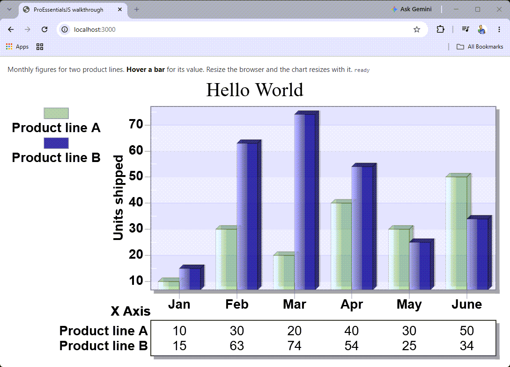

# ProEssentialsJS -- JavaScript Chart Quick Start

**The smallest ProEssentials chart on a web page, and the file to read first.**
`app.js` follows the C# WinForms walkthrough property for property, so a desktop
customer already knows every line.

---



If you are new to ProEssentialsJS and have not seen our charts running in
your browser, try these:

- **[120 chart examples](https://gigasoft.com/javascript-chart-live-demo/)** -- the whole example set, with the source beside each chart
- **[100 million points](https://gigasoft.com/fastest-javascript-chart-live-demo/)** -- every point re-passed and re-rendered each frame, with live FPS
- **[3D surfaces and contours](https://gigasoft.com/javascript-3d-surface-chart-live-demo/)** -- a WebGPU mesh from real height-map data, rotate and zoom it

* **A desktop engine, not a web library.** The same native C++ engine
  Gigasoft has shipped since 1995 -- running inside instrumentation, SCADA,
  medical and test-and-measurement products -- compiled to WebAssembly.
* **The JavaScript property names are the WinForms property names.** If you
  have used ProEssentials on the desktop, you already know the API. AI assisted
  with our pe_query.py Ai-Data repo for ground truth intelligence based on
  our WinForms.
* **Compute shaders feeding compute shaders, and a zero-copy path.** The chart
  is handed a pointer into the WebAssembly heap, and GPU stages consume each
  other's output without returning to the CPU. This is full-data-replacement
  work: large line data, 3D surfaces, 2D contours, where the whole dataset
  changes every frame. A charting engine designed by electrical engineers,
  engineered to the nth degree. ProEssentialsJS is not just faster, it's
  magnitudes faster.
* **No WebGL context limit.** Canvas2D is not a GPU context, so putting many
  charts on one page does not run into the browser's cap. The GPU is engaged
  where the chart needs it.
* **Free for commercial use under USD 250,000 revenue**, redistribution
  included. No licence key, no activation, no domain lock, no phone home, no
  watermark.

## Run it

```
git clone https://github.com/GigasoftInc/proessentials-js-starter.git
cd proessentials-js-starter
npm start
```

Then open http://localhost:3000. **Nothing to install** -- the server is one
file with no dependencies, and the library is committed here.

Opening `index.html` from disk does not work: the page loads a WebAssembly
module, which browsers refuse over `file:`. The page says so if you try.

## What a page needs

Two lines:

```html
<script src="proessentials.iife.js"></script>
<script type="module" src="app.js"></script>
```

The first is the whole runtime -- engine, control, menus, tooltips, scrollbars,
dialogs and the 3D layer. The second is your code, where you import the facade
for the chart kind you want:

```js
import { attachApi } from './pe-api-graph.js';
```

`pe-api-graph.js` is the Pego facade. The others are `pe-api-sgraph.js`,
`pe-api-pie.js`, `pe-api-polar.js` and `pe-api-3d.js`.

## Editor intellisense

It works with no configuration. Open the folder and type -- `PeControl`,
`Pego1.` and the whole property tree resolve, because the facade declaration
references the rest. There is no `jsconfig.json` here on purpose.

## Where to go next

| | |
|---|---|
| start here | [proessentials-js-starter](https://github.com/GigasoftInc/proessentials-js-starter) -- the smallest chart, the file to read first |
| every example | [proessentials-js-demo](https://github.com/GigasoftInc/proessentials-js-demo) -- 120 examples with the source beside each |
| large data | [proessentials-js-gigaprime2d](https://github.com/GigasoftInc/proessentials-js-gigaprime2d) -- millions of points, replaced every frame |
| 3D | [proessentials-js-gigaprime3d](https://github.com/GigasoftInc/proessentials-js-gigaprime3d) -- surfaces and contours on WebGPU |
| your AI | [proessentials-ai-data](https://github.com/GigasoftInc/proessentials-ai-data) -- ground truth for an AI assistant: property paths, enums, 116 examples |
| the product | <https://www.gigasoft.com> -- documentation, pricing, the walkthrough |

## Licence and support

**Free for commercial use, including redistribution, by organizations under
USD 250,000 annual gross revenue** -- no watermark, no feature gates, no
expiry. Above that, prices are published through to the largest buyer; a licence
is perpetual, paid once and royalty free.

See [PEJS-LICENSE.md](PEJS-LICENSE.md), [THIRD-PARTY-NOTICES.md](THIRD-PARTY-NOTICES.md)
and <https://www.gigasoft.com/license>.

**Support is free and unlimited, answered by the people who wrote the engine:
<https://www.gigasoft.com/contact>.** Issues are turned off on this repository
so that every question reaches somebody who can answer it.
